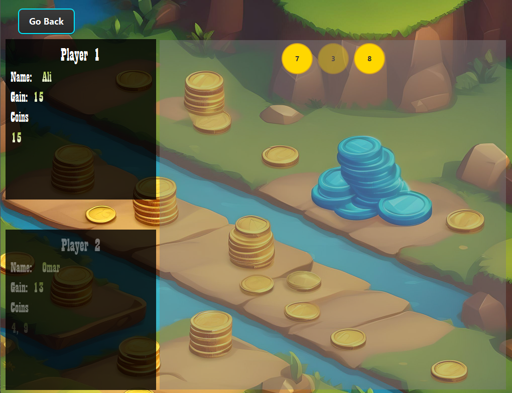

# Optimal Game Strategy Using Dynamic Programming

## Problem Description

This program solves the **Optimal Game Strategy Problem** using **Dynamic Programming**. In this two-player game, coins are arranged in a row. Players take turns picking either the first or last coin in the row, and the objective is for the first player to maximize their winnings while minimizing the potential winnings for the second player.

The goal is to determine the maximum amount a player can definitely win if they move first.

### Game Rules:

- There are an even number of coins arranged in a row.
- Players take turns picking either the first or last coin from the remaining coins.
- The objective is to maximize the total amount of money a player can win by the end of the game.

## Problem Solution

In this solution, we use dynamic programming to compute the maximum value a player can secure while playing optimally. The approach involves considering the best possible outcome for each turn, given the opponent's strategy. This strategy guarantees the player the maximum amount of money that can be secured, assuming both players play optimally.

### Steps Involved:

1. Create a dynamic programming table to store intermediate results.
2. For each state of the game (each subarray of coins), calculate the maximum money the current player can secure by either picking the first or last coin.
3. Fill the table in such a way that each entry represents the maximum value a player can secure given the current subarray of coins.

### Example:

For the following input:

```plaintext
Coins[] = [4, 15, 7, 3, 8, 9]
```

The expected result (maximum amount the first player can guarantee) is:

```plaintext
Expected Result = 27
```
## UI Demo

Below is a screenshot of the user interface where the game and the DP table are visualized:





